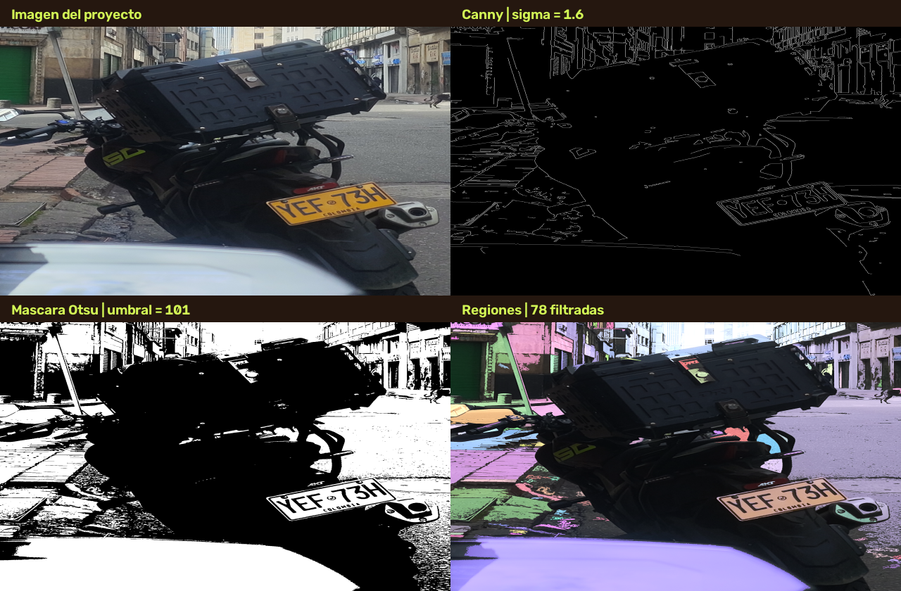

# Semana 09 - Vision por computador en SecurityPlate

## Imagen y relacion con el proyecto

Se proceso `data/imagen_proyecto.png`, una fotografia de una motocicleta con placa colombiana. Es pertinente para SecurityPlate porque muestra el identificador vehicular dentro de una escena real; se analizan intensidad, contraste, bordes y regiones como etapas exploratorias previas a localizar y clasificar caracteres. La imagen procesada mide 1334 x 1800 pixeles. La intensidad media en gris es 94.06, con desviacion estandar 62.60; las medias BGR son 96.61, 94.65 y 91.84.

## Deteccion de contornos con Canny

Se aplico suavizado gaussiano con sigma **1.6** antes de Canny. Los bordes ocupan 2.75% de los pixeles. Los contornos resaltan cambios de intensidad que pueden delimitar placa, letras y objetos; sombras, perspectiva y texturas del vehiculo tambien producen bordes, por lo que no constituyen por si solos una deteccion de placa.

| Sigma | Pixeles de borde |
|---:|---:|
| 0.8 | 5.42% |
| 1.6 | 2.75% |
| 3.0 | 0.44% |

Al aumentar sigma se suavizan detalles y ruido; puede reducir bordes espurios, pero tambien borrar trazos finos de los caracteres. El efecto depende de la iluminacion y de la resolucion de la imagen.

## Segmentacion por Otsu

**Umbral Otsu obtenido:** 101 en escala de grises de 8 bits. La mascara binaria selecciona regiones claras sobre fondo oscuro (pixeles por encima del umbral). Otsu separa intensidades globales y no conoce la ubicacion de la placa; en esta escena compleja puede incluir regiones ajenas al identificador.

## Regiones conectadas

Se encontraron **78 regiones** con area minima de 240 pixeles, de 1495 componentes sin filtrar. Son grupos de pixeles de la mascara, no objetos confirmados: una letra puede fragmentarse o unirse a otra y el fondo puede generar componentes. El conteo no debe interpretarse como cantidad de caracteres.

## Evidencia visual

El panel muestra la imagen original, los bordes, la mascara y las regiones filtradas por area.

## Limitaciones y aplicacion futura

- La placa ocupa una fraccion pequena de la escena y esta inclinada; no se aislo una region de interes ni se corrigio perspectiva.
- La iluminacion, las sombras, reflejos y texturas generan intensidades y contornos que confunden a los metodos globales.
- El umbral de Otsu supone grupos de intensidad separables; no garantiza segmentar correctamente la placa.
- El etiquetado conectado depende de la mascara y de un area minima, y no equivale a reconocimiento de caracteres.

Como siguiente etapa, la mascara y los contornos pueden apoyar la localizacion de la placa, rectificacion geometrica y extraccion de recortes. Estos recortes podrian alimentar el clasificador CNN de Semana 08, que reconoce categorias de caracteres; esta practica no realiza OCR ni autoriza decisiones de acceso.

## Ejecucion

Desde la raiz del repositorio, `python src/semana09_vision.py` procesa la imagen fija, guarda la evidencia y regenera este informe. Para usar la interfaz de carga, ejecute `python src/semana09_vision.py --serve` y abra `http://127.0.0.1:8765/dashboard/`.
