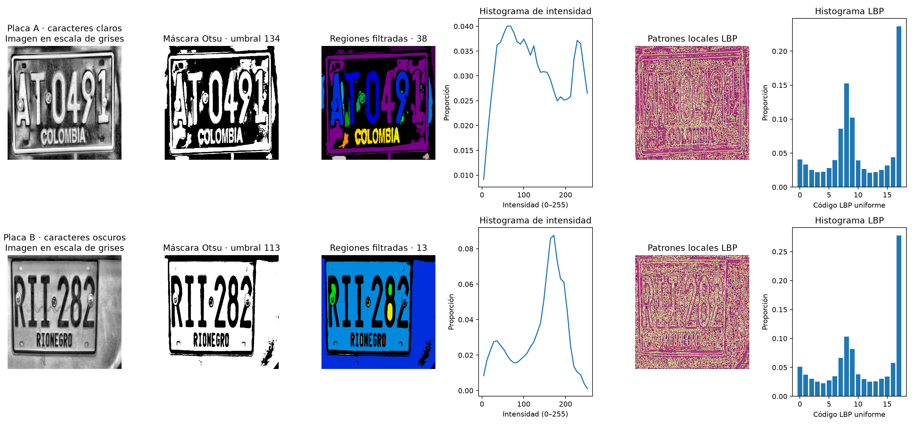

# Semana 10 - Segmentacion, regiones y texturas en SecurityPlate

## Objetivo y relacion con el proyecto

Se analizaron 2 imagenes de placas colombianas del conjunto de prueba de SecurityPlate. Este paso complementa la exploracion de bordes y regiones de Semana 09 y describe numericamente la intensidad, el tamano de componentes conectados y la textura local. Los descriptores pueden servir como evidencia exploratoria para priorizar recortes o comparar condiciones visuales antes del reconocimiento de caracteres de Semana 08; por si solos no localizan una placa ni realizan OCR.

Las imagenes proceden del conjunto de placas colombianas usado por el proyecto, distribuido bajo licencia CC BY 4.0. Fuente: [Roboflow Universe - placas colombianas](https://universe.roboflow.com/dylan-leonardo-duitama-soriano/placas-colombianas-ohtrf).

## Imagenes seleccionadas

| Imagen | Archivo | Que representa |
|---|---|---|
| Placa A · caracteres claros | `data/dataset/test/images/plate_1677361962348_Screenshot-2023-02-05-at-12-27-46-AM_png_jpg.rf.d9JVDwlw2brvnOx9gIKk.jpg` | Placa colombiana de fondo oscuro con caracteres claros, anotada en el conjunto de prueba. |
| Placa B · caracteres oscuros | `data/dataset/test/images/plate_1677361962434_Screenshot-2023-02-05-at-12-27-04-AM_png_jpg.rf.TwbpUZbY11NUMFfgA3NA.jpg` | Placa colombiana clara con caracteres oscuros, anotada en el conjunto de prueba. |

## Segmentacion por intensidad y regiones

Para cada imagen se calculo un histograma de 32 intervalos sobre intensidades de 0 a 255. El umbral de Otsu se calcula automaticamente a partir de ese histograma y la mascara selecciona los pixeles **por encima** del umbral. Esta separacion global permite observar grupos de intensidades, pero no identifica semantica: los pixeles claros pueden pertenecer a letras, bordes de la placa o al fondo.

Se etiquetaron componentes con `measure.label(..., connectivity=2)`. `regionprops()` midio las regiones y se conservaron las de area igual o mayor al umbral minimo relativo indicado para cada imagen (0.01% del area, con minimo de 10 pixeles).

| Imagen | Umbral Otsu | Pixeles seleccionados | Area minima (px) | Regiones antes del filtro | Regiones conservadas | Area media (px) | Desviacion estandar (px) |
|---|---:|---:|---:|---:|---:|---:|
| Placa A · caracteres claros | 134.00 | 44.42% | 17 | 158 | 38 | 2012.42 | 4409.56 |
| Placa B · caracteres oscuros | 113.00 | 71.50% | 17 | 43 | 13 | 9510.00 | 21814.71 |

El area media resume el tamano de las regiones que superan el filtro y la desviacion estandar expresa su variabilidad. Las componentes son grupos de pixeles conectados, no objetos ni caracteres confirmados.

## Comparacion de texturas LBP

Se calculo LBP uniforme con radio 2 y 16 vecinos por pixel. El histograma resume la frecuencia relativa de cada codigo. La distancia L1 entre histogramas de cada par se muestra abajo; valores cercanos a 0 indican distribuciones mas parecidas y valores mayores indican una diferencia mas marcada.

| Comparacion | Distancia L1 LBP |
|---|---:|
| Placa A · caracteres claros vs. Placa B · caracteres oscuros | 0.1916 |

Las diferencias observadas describen los patrones locales de claro y oscuro presentes en cada imagen. No implican por si solas que una placa sea mas legible: el encuadre, el contraste, la iluminacion, los reflejos y la escala tambien alteran los codigos LBP.

## Vector de caracteristicas y evidencia

Cada imagen se representa con 53 valores en este orden: area media, desviacion estandar del area, cantidad de regiones conservadas, histograma de intensidad de 32 intervalos e histograma LBP de 18 codigos. `artifacts/semana10_features.npy` contiene una matriz de forma (2, 53); cada fila corresponde a una imagen en el mismo orden de las tablas. Los histogramas se normalizan a proporciones para que sean comparables aunque cambie el numero de pixeles.

La figura compara por imagen la escala de grises, mascara de Otsu, etiquetas filtradas, histograma de intensidad, mapa LBP e histograma LBP.

## Limitaciones y aplicacion futura

- Otsu usa un unico umbral global y no distingue la placa del fondo. Reflejos, sombras y variaciones de iluminacion pueden invertir o fragmentar las regiones.
- El umbral de area elimina componentes pequenos, pero puede descartar trazos delgados de caracteres o conservar ruido grande.
- La cantidad y el area de regiones dependen del tamano, contraste y resolucion de la imagen; no equivalen a una deteccion de objetos.
- LBP resume patrones locales y pierde su ubicacion. Diferencias de escala, rotacion, enfoque y contraste afectan la comparacion.
- El vector es un descriptor exploratorio, no un clasificador ni una lectura de matricula. La autorizacion de acceso requiere las etapas de reconocimiento y reglas del sistema.

En una etapa posterior, estos valores podrian combinarse con calidad de imagen o predicciones de la CNN para analizar recortes de placa. Primero se debe validar esa utilidad con datos etiquetados y una evaluacion separada; esta practica no modifica el modelo ni decide accesos.

## Ejecucion reproducible

Desde la raiz del repositorio, ejecute `python src/semana10_texturas.py`. El script procesa las dos imagenes preseleccionadas y regenera `artifacts/semana10_features.npy`, `artifacts/semana10_histograma.png` y este informe.
